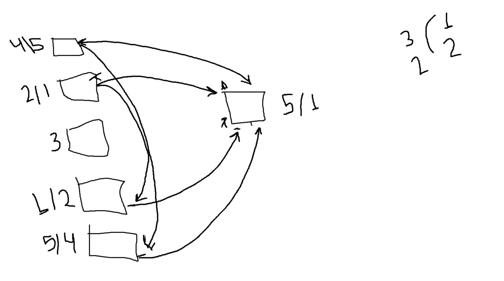

# data-structures-and-algorithms

## Challenge 1
# Reverse an Array
the arrays in js has a build in function to revers it's values

## Challenge
the Challenge is to revers the array values without using this build in function

## Approach & Efficiency
this Challenge take from me 20 min including tow ways to do that
I used in the first way for loop
and in the other way I used some mathhimatical logic to do so

## Solution

### **************************************

## Challenge 2
# problem domain :
Write a function called insertShiftArray which takes in an array and the value to be added.
 Without utilizing any of the built-in methods available to your language,
 return an array with the new value added at the middle index.

## Challenge

Write a function called insertShiftArray which takes in an array and the value to be added.
 Without utilizing any of the built-in methods available to your language,
 return an array with the new value added at the middle index.

## Approach & Efficiency
this Challenge take from me 20 min including tow ways to do that
I used in the first way for loop
and in the other way I used some mathhimatical logic to do so

## Solution

we need to insert a value ion the middle of an array so we need to get the length of the array
and then we devided on 2 to get the half of it 
then we increase the value by 1 so we make a place to the new value to sit on the array

if the array length was even for example 6
then the new index will be 
(6 / 2) + 1 = 4

if the array length was odd for example 7
then the new index will be 
((7 - 1) / 2) + 1 = 4

itriate the array

if the i == the new value index
new array.push(value)
new array.push(arr[i])
 else 
new array.push(arr[i])

## ************************************************
## Challenge 1
# Reverse an Array
the arrays in js has a build in function to revers it's values

## Challenge
the Challenge is to revers the array values without using this build in function

## Approach & Efficiency
this Challenge take from me 20 min including tow ways to do that
I used in the first way for loop
and in the other way I used some mathhimatical logic to do so

## Solution
