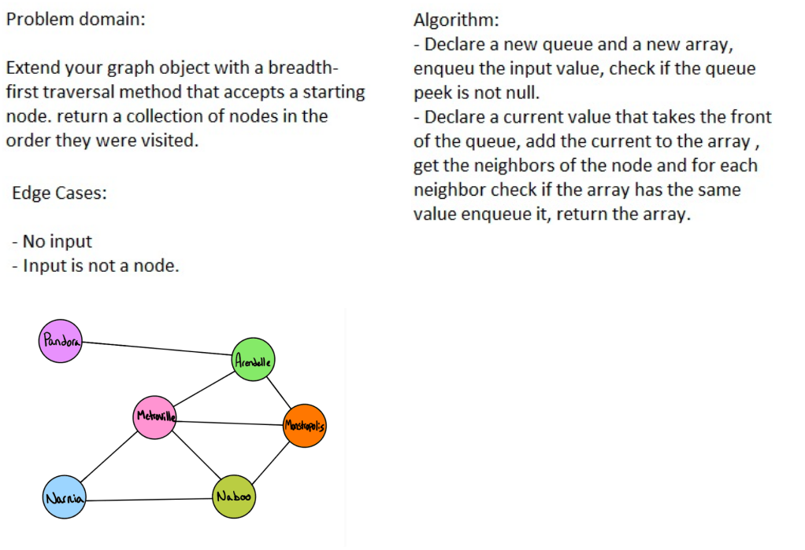

# Challenge 36

## Challenge 36
Extend your graph object with a breadth-first traversal method that accepts a starting node. Without utilizing any of the built-in methods available to your language, return a collection of nodes in the order they were visited. Display the collection.

## Approach & Efficiency
the function will create new instance of the gibin tree and update it's nodes values
so we will need some kind of looping through the tree's node

## solution :

