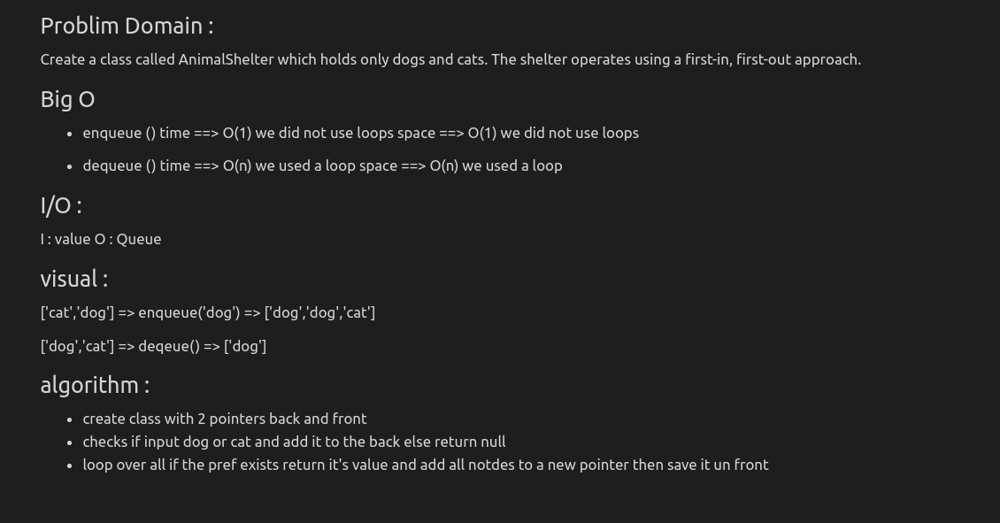

## Challenge 12
 - Create a Animal Shelter class to initiate queue using the following methods:
    1. enqueue()
    2. dequeue()
## Approach & Efficiency
 - Create a queue class & implement the required methods.

## solution :

