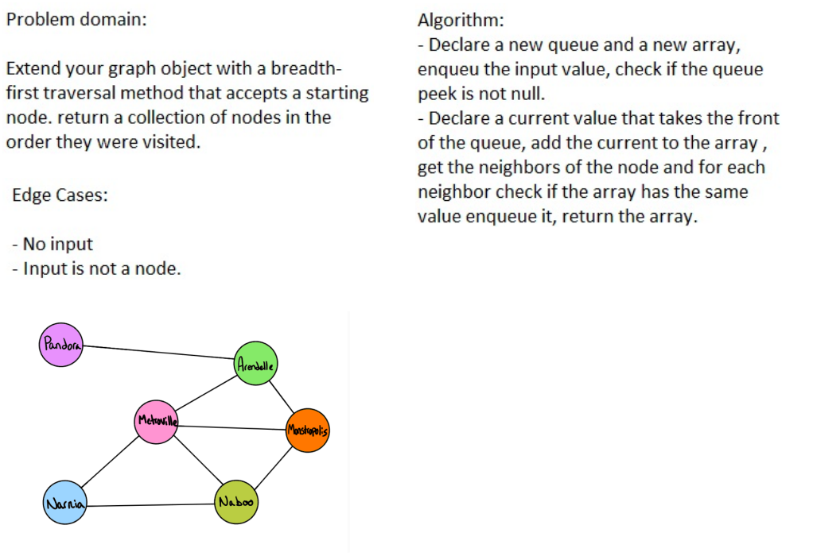

# Challenge 37

## Challenge 37
Write a function based on the specifications above, which takes in a graph, and an array of city names. Without utilizing any of the built-in methods available to your language, return whether the full trip is possible with direct flights, and how much it would cost.

## Approach & Efficiency
the function will create new instance of the gibin tree and update it's nodes values
so we will need some kind of looping through the tree's node

## solution :

