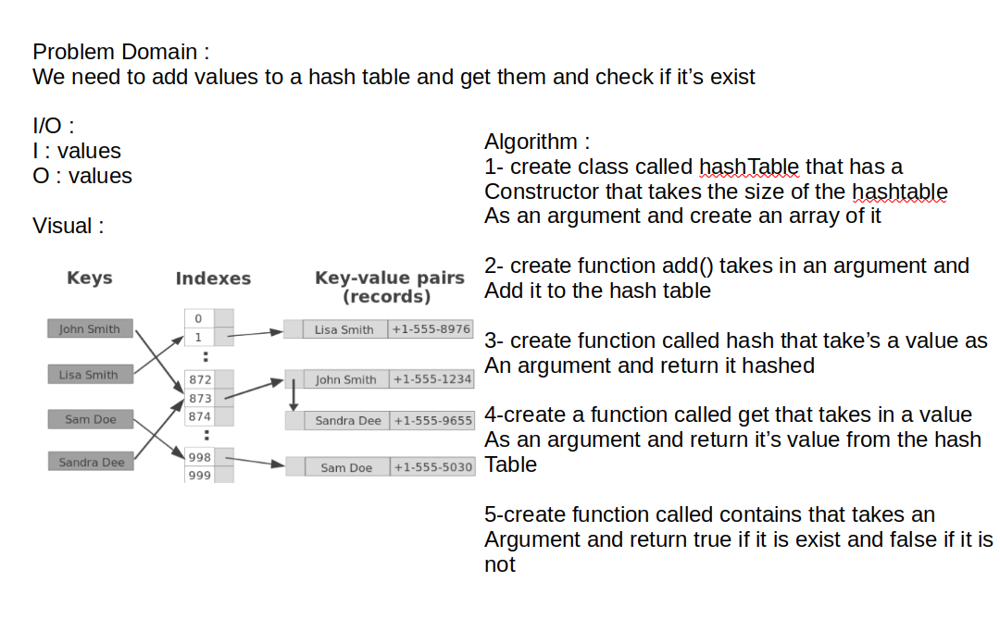

# Hash Table :

A hash table (also called a hash, hash map, unordered map or dictionary) is a data structure that pairs keys to values. Its a technique to convert a range of key values into a range of indexes of an array. Its used to implement an associative array, a structure that can map keys to values. A Hash Table uses a hash function to compute an index into an array of buckets or slots, from which the desired value can be found. From

## Approach & Efficiency
this Challenge take from me 20 min including tow ways to do that
I used in the first way for loop
and in the other way I used some mathhimatical logic to do so

## whitBoard

