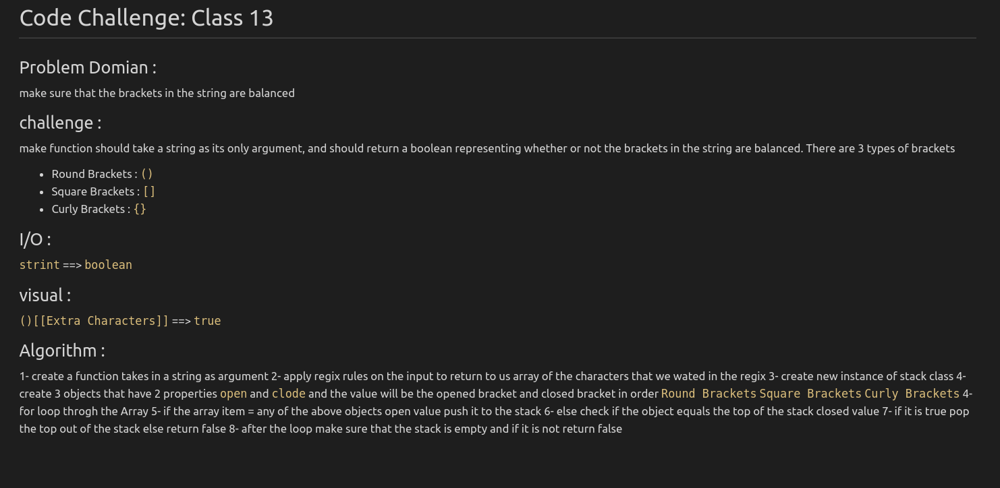

# Code Challenge: Class 13

## Challenge 12
make function should take a string as its only argument, and should return a boolean representing whether or not the brackets in the string are balanced. There are 3 types of brackets

* Round Brackets : `()`
* Square Brackets : `[]`
* Curly Brackets : `{}`
## Approach & Efficiency
 - the function will use the regix to get out brackets out of the input string and loop through it and make sure each open brackt
 is closed in order.

## solution :

